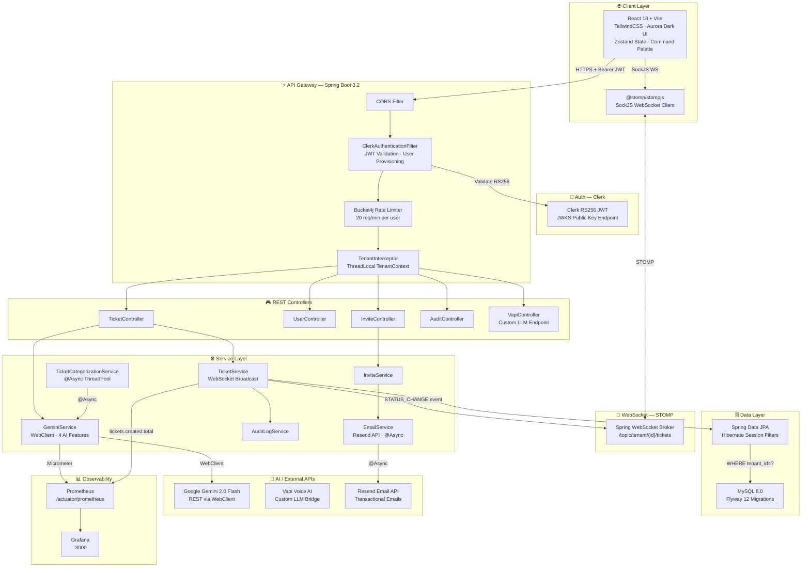

# Multi-Tenant SaaS — AI-Powered Ticket Management Platform

[](https://github.com/your-username/multi-tenant-saas/actions/workflows/ci.yml)
[](https://openjdk.org/projects/jdk/17/)
[](https://spring.io/projects/spring-boot)
[](https://react.dev)
[](https://www.mysql.com/)
[](https://clerk.com)
[](https://deepmind.google/technologies/gemini/)
[](https://prometheus.io)
[](https://docs.docker.com/compose/)

> A production-grade, AI-powered multi-tenant ticket management system with real-time WebSocket updates, Prometheus/Grafana observability, and automated CI/CD.

---

## System Architecture



---

## Architecture Highlights

### ✅ True Multi-Tenancy (Hibernate Filter Isolation)
Tenant isolation is enforced **at the database query level** via Hibernate named filters activated through Spring AOP — not just application-layer filtering. Each request flows through:

1. `TenantInterceptor` → sets `ThreadLocal<UUID>` from `X-Tenant-Slug` header
2. Hibernate `@Filter` → appends `WHERE tenant_id = ?` to **every** query
3. `afterCompletion` → clears `TenantContext` to prevent cross-request leakage

Verified by `TenantIsolationTest` — proves Tenant B cannot access Tenant A's data even querying repositories directly.

### ✅ Clerk JWT Authentication (RS256 / JWKS)
No shared secrets. `ClerkAuthenticationFilter` fetches and caches the JWKS, verifies RS256 signatures, and auto-provisions users on first login.

### ✅ 3-Layer RBAC
| Layer | Mechanism |
|-------|-----------|
| Route | Spring Security `authorizeHttpRequests` |
| Method | `@PreAuthorize("hasRole('TENANT_ADMIN')")` |
| UI | React context + conditional rendering + AdminRoute guard |

### ✅ AI Features (Gemini 2.0 Flash via WebClient)
| Feature | Description |
|---------|-------------|
| **Live Categorization** | Debounced 900ms call as user types — AI suggests category + priority |
| **Circular Confidence Meter** | SVG ring showing AI confidence % on TicketCreate |
| **Draft Reply Generation** | AI writes first support response inline in comment box |
| **Semantic Duplicate Detection** | Detects similar open tickets before submission |
| **Rate Limited** | Bucket4j token-bucket (20 req/min per user) |
| **Prompt Injection Protection** | `sanitize()` strips `ignore previous instructions` patterns |

> **Migrated to WebClient** — all Gemini calls are now non-blocking reactive HTTP with 10s timeout, Prometheus timing, and graceful `onErrorReturn` fallback.

### ✅ Real-Time WebSocket Updates
Status changes broadcast to `/topic/tenant/{tenantId}/tickets` via STOMP. Frontend subscribes via `useTicketSocket` hook and updates Zustand store — no polling.

### ✅ Observability
- `micrometer-registry-prometheus` exposes `/actuator/prometheus`
- Custom metrics: `gemini.call.duration`, `gemini.calls.total`, `tickets.created.total`
- Grafana on `:3000` wired to Prometheus via `docker-compose.yml`

---

## Tech Stack

| Layer | Technology |
|-------|------------|
| Backend | Spring Boot 3.2, Java 17 |
| HTTP Client | WebClient (reactive, replaces RestTemplate) |
| Auth | Clerk RS256 JWT via JWKS |
| Database | MySQL 8.0 + Flyway (12 migrations) |
| ORM | Spring Data JPA + Hibernate session filters |
| Real-time | Spring WebSocket / STOMP |
| AI | Google Gemini 2.0 Flash (WebClient) |
| Voice | Vapi (custom LLM endpoint) |
| Email | Resend API (@Async, fire-and-forget) |
| Rate Limiting | Bucket4j (token-bucket) |
| Metrics | Micrometer + Prometheus + Grafana |
| State Mgmt | Zustand (frontend) |
| Frontend | React 18, Vite, TailwindCSS |
| CI/CD | GitHub Actions (test → build → docker) |
| Coverage | JaCoCo (10% enforced minimum, target 70%) |
| Infra | Docker Compose, Nginx, Vercel |
| Testing | JUnit 5, Mockito, Spring MockMvc, H2 |

---

## Quick Start

```bash
# 1. Copy and configure environment variables
cp .env.example .env.local
# Fill in: DB_*, CLERK_*, GEMINI_API_KEY, VAPI_*, RESEND_API_KEY

# 2. Start all services (MySQL + Backend + Frontend + Prometheus + Grafana)
docker compose up --build

# Frontend:    http://localhost:3001
# Backend:     http://localhost:8081
# Swagger UI:  http://localhost:8081/swagger-ui.html
# Prometheus:  http://localhost:9090
# Grafana:     http://localhost:3000  (admin / admin)
# Health:      http://localhost:8081/actuator/health
# Metrics:     http://localhost:8081/actuator/prometheus
```

---

## Security Model

| Area | Implementation |
|------|---------------|
| Secrets | Environment variables only — no hardcoded credentials |
| Actuator | Only `health`, `info`, `metrics`, `prometheus` exposed |
| Input | Bean Validation on all DTOs + AI prompt sanitization |
| Rate Limiting | Bucket4j per-user token bucket on AI endpoints |
| Tracing | `X-Request-ID` in every response, correlated in MDC logs |
| CORS | Explicit allowlist — localhost + Vercel production URL |

---

## Running Tests with Coverage

```bash
cd backend
mvn test jacoco:report

# HTML report: target/site/jacoco/index.html
# CI enforces minimum 10% line coverage (target: 70%)
```

| Test Class | What It Proves |
|------------|---------------|
| `TenantIsolationTest` | Tenant B cannot see Tenant A's data (core security) |
| `TicketServiceTest` | Status change audit logs, WebSocket broadcast trigger |
| `GeminiServiceTest` | Graceful degradation, sanitization, blank API key |
| `InviteServiceTest` | Role validation, token generation, expiry, duplicate guard |
| `AuditLogServiceTest` | Null TenantContext skip, correct field mapping |
| `TicketControllerSecurityTest` | 401 on unauthenticated requests |

---

## Project Structure

```
multi_tenant_Saas_project/
├── .github/workflows/ci.yml        # CI/CD: test → coverage → docker
├── monitoring/
│   └── prometheus.yml              # Prometheus scrape config
├── backend/
│   └── src/
│       ├── main/java/com/example/saas/
│       │   ├── config/             # Security, WebSocket, CORS, interceptors
│       │   ├── controller/         # REST + Vapi LLM controllers
│       │   ├── core/               # TenantContext (ThreadLocal)
│       │   ├── dto/                # Request/response DTOs
│       │   ├── exception/          # Typed exceptions + global handler
│       │   ├── model/              # JPA entities (Hibernate filters)
│       │   ├── repository/         # Spring Data JPA repositories
│       │   ├── security/           # Clerk JWT filter + tenant filter
│       │   └── service/            # Business logic, AI, Email, WebSocket
│       └── test/                   # Unit + integration tests
├── frontend/
│   └── src/
│       ├── components/             # Layout, CommandPalette, ErrorBoundary
│       ├── components/admin/       # AdminSidebar, AnalyticsChart, StatCard
│       ├── context/                # Auth + tenant context
│       ├── hooks/                  # useTicketSocket (WebSocket)
│       ├── pages/                  # Dashboard, TicketCreate, TicketDetail, Admin
│       ├── store/                  # Zustand stores (useTicketStore)
│       └── utils/                  # toast.js, timeAgo.js
└── docker-compose.yml              # MySQL + Backend + Frontend + Prometheus + Grafana
```

---

## Key Engineering Decisions (ADRs)

| Decision | Rationale |
|----------|-----------|
| **Hibernate session filter** over `WHERE user_id` | True tenant isolation — enforced at ORM level, not application code |
| **Clerk JWKS** over Spring Security OAuth2 | Simpler setup, RS256 public-key-only validation, no secret leakage |
| **WebClient** over RestTemplate | Non-blocking reactive HTTP, better timeout control, Prometheus integration |
| **Zustand** over Redux | Zero boilerplate, devtools support, minimal API surface |
| **STOMP/SockJS** over raw WebSocket | Auto-reconnect, fallback transports, topic routing built-in |
| **Resend** over SMTP | Deliverability, HTML templates, transactional email purpose-built API |
| **H2 in-memory** for tests | No DB infrastructure needed in CI, MySQL-compatibility mode |
| **JaCoCo** enforced in CI | Prevents coverage regression — gate before merge |
